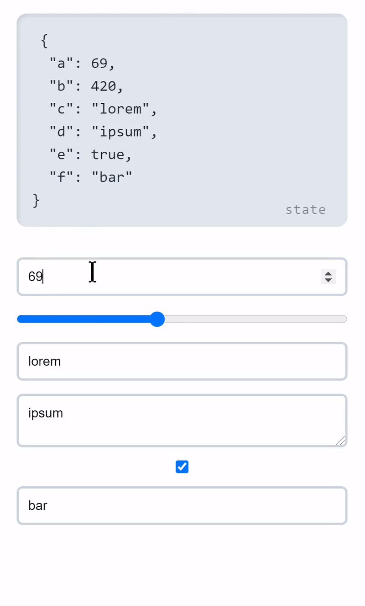

<!-- logo -->
<p align="center">
  
</p>

<!-- tag line -->
<h3 align='center'> Make Your React App Truly Reactive ! </h3>

<!-- primary badges -------------------------------------->
<p align="center">
  <!-- version -->
  
  <!-- size -->
  
  <!-- downloads npm per week  -->
  
  <!-- chat -->
  <a href='https://join.slack.com/t/radioactive-state/shared_invite/zt-gwd1rsvr-vkoizw5RG5rk9rwsdgT3gQ'>
    
  </a>
  <!-- stars -->
  
  <!-- follow -->
  
  <!-- Twitter intent -->
  <a href='https://twitter.com/intent/tweet?url=https%3A%2F%2Fgithub.com%2FMananTank%2Fradioactive-state&via=MananTank_&text=Make%20your%20@reactjs%20App%20Truly%20Reactive%20with%20radioactive-state&hashtags=react%2CradioactiveState' target='_blank'>
    
  </a>
</p>

<!-- Coverage badges ---------------------------------- -->
<p align='center'>
  
  
  
  
</p>
<br/>


## Features

☢ Deeply Reactive, Directly Mutate State at any level to Update Component

⚡ Blazing Fast - 25% faster than `useState`

📺 No Extra Re-Renders - Auto Mutation batching

🌿 Always Fresh State, _unlike_ `useState`

🧬 Reactive Bindings For Inputs

⚛ Reactive Props

☕ Zero Dependencies, Ultra Light-Weight `< 1kb`

<br/>


## 🌻 Motivation

While the React's `useState` hook has been great for simple states, it is still **a pain to update a complex state**.

It also comes with other problems like **not having the access to fresh state right away** after the new state is set and closure problems because of state's value only updating after a re-render.

We can eliminate these problems, Improve performance and Introduce exciting new features in React with a **Truly Reactive State !**

Enter `radioactive-state`

<br/>


## Installation
```bash
npm i radioactive-state
```
<br/>


## ☢️ What's a Radioactive-State ?

Radioactive state is a **deeply reactive** state.
When it is mutated at any level ( shallow or deep ) it re-renders the component automatically !

No need to set the state. No need to use libraries like immer.js to produce a new state. No overhead of creating a new state at all! **Just mutate your state, that's it !**

<br/>


## ✨ Creating a Radioactive State With `useRS` hook

`radioactive-state` gives you a hook `useRS` (use radioactive state) which lets you create a radioactive state in your React Components.

### Examples

> Click on the triangle icon to expand the Example


<details>
<summary>
🍭 <strong>Counter App</strong>
<p align='center'>
  
</p>
</summary>

<!-- Live Demo -->
<a href='https://codesandbox.io/s/counter-example-v9bsh?file=/src/Counter.js' target="_blank" title='counter app'> Live Demo </a>

<!-- Code -->
```jsx
import useRS from 'radioactive-state';

const Counter = () => {
  // create a radioactive state
  const state = useRS({
    count: 0,
  });

  // yep, that's it
  const increment = () => state.count++;

  return <div onClick={increment}>{state.count}</div>;
};
```
</details>
<br/>

---


<details>
<summary>
<strong> 🍡 Array Of Counters App </strong>
<p align='center'>
  
</p>
</summary>

Let's take this a step further, Let's make an app that has an array of counters, each of them can be incremented individually and sum of all the counters is displayed too

This examples shows that deep mutation also triggers a re-render and that **you can use any mutative functions directly**

<a href='https://codesandbox.io/s/counters-example-sctz6?file=/src/Counters.js' target="_blank" title='counter app'> Live Demo </a>

```jsx
import useRS from "radioactive-state";

const Counters = () => {

  const state = useRS({
    counts: [0],
    sum: 0
  });

  const increment = (i) => {
    state.counts[i]++;
    state.sum++;
  };

  const addCounter = () => state.counts.push(0);

  return (
    <>
      <button onClick={addCounter}> Add Counter </button>
      <div className="counts">
        {state.counts.map((count, i) => (
          <div className="count" onClick={() => increment(i)} key={i}>
            {count}
          </div>
        ))}
      </div>
      <div className="count sum">{state.sum}</div>
    </>
  );
};
```
</details>
<br />


## 📺 No Extra Re-Renders, Mutations are Batched

You might be wondering:

> "What if I mutate multiple keys in state, Is that going to trigger a re-render component multiple times ?"

**Nope!** 😉

### Example:

```js
// suppose you are mutating multiple things in your state in a function doStuff

const doStuff = () => {
  state.a = 200;
  state.b.x.y.push([10, 20, 30]);
  state.c++;
  state.c++;
  state.c++;
  delete state.d.e.f;
  state.e.splice(10, 1);
  state.f = state.f.filter(x => x.completed);
};

// When this function is called
// it is not **not** going to trigger re-render of component 8 times 😉
// it will only trigger re-render 1 time! - No extra re-renders! 🤗
```

#### How is that possible ?

Mutations are batched into a one single mutation.
So, No matter how many times you mutate the state, it only triggers re-render once

This allows you to perform a complex mutation in multiple steps without having to worry about re-renders

<details>
<summary> Example </summary>

```javascript

const addNewFriend = (newFriendID) => {
  const {users, userID} = state
  const user = users[userID]
  const newFriend = users[newFriendID]
  user.friends.push(newFriendID)
  newFriend.friends.push(userID)
}
```

</details>
<br/>


## ⚛ Reactive Props

In traditional React, Props are considered immutable and mutating them does nothing. But When using radioactive-state, if you pass a piece of state as a prop to child component, this **child component has the capability to trigger a re-render in parent component** by mutating the prop !

This can be a **powerful feature**, where **you no longer have to pass functions as props to child component for triggering a re-render in parent component**, which also removes the need to memoize that function


### Example: Todos App

<!-- Live Demo -->
<a href='https://codesandbox.io/s/todos-example-zivos?file=/src/Todos.js' target='_black'> Live Demo </a>

<!-- Todos GIF -->
<p align='center'>
  
</p>


<br/>


## 🌿 State is always fresh !

Unlike `useState`, `useRS`'s state is always fresh

#### What does that mean ?

When you set a new state using `useState`'s setter function, it does not directly change the value of state. value of state is changed only after a re-render. This can cause some weird bugs.

Let's see those problems and see how `radioactive-state` is immune to them.


<details>
<summary> <code>useState</code>'s state is not always fresh </summary>
<br/>
Let's add Logs before and after the state is set in our counter app.

<!-- Live Demo -->
<a href='https://codesandbox.io/s/usestate-s-state-is-not-always-fresh-pfzpw?file=/src/App.js' target='_black'> Live Demo </a>

<!-- Code -->
```js
const [count, setCount] = useState(0)

const increment = () => {
  console.log('before: ', count)
  setCount(count + 1)
  console.log('after: ', count)
}

// when increment is called, you would get this logs:
// before: 0
// after: 0

// same thing happens no matter what data type you are using - reference type or value type
```
<br/>


### `useRS` solves it !

`useRS`'s state is mutated directly by the user. So, **No need to wait for a re-render to get the fresh state**.

<a href='https://codesandbox.io/s/usestate-s-state-is-not-always-fresh-pfzpw?file=/src/App.js' target='_black'> Live Demo </a>

```js
const state = useRS({
    count: 0
  })

const increment = () => {
  console.log('before: ', state.count)
  state.count++
  console.log('after: ', state.count)
}

// works as expected 😄
// before: 0
// after: 1
```

With radioactive-state, You can use your state with confidence that whenever you use it, it's gonna be fresh ! 😙
---
</details>


<details>
<summary> <code>useState</code>'s closure problem </summary>
<br/>

Let's assume that increment function is async and before incrementing the value of count, we have to wait for some async task.

Now guess what happens if you click the counter quickly 3 times?
count is only going to increment to 1 instead of 3, even though increment function is called 3 times !

<!-- Live Demo -->
<a href='https://codesandbox.io/s/usestates-closure-problem-x6g28?file=/src/App.js' target='_black'> Live Demo </a>

<!-- Code -->
```js
const [count, setCount] = useState(0)

const increment = async () => {
  await someAsyncTask(); // assume that this takes about 500ms
  setCount(count + 1) // does not work properly
}

```

This happens because setCount keeps using old value of count until the component re-renders.
This is because increment function "closes over" the count when it was defined.

To fix this issue, you update the state using a function like this:

```js
setCount(previousCount => previousCount + 1)
```

This gets awkward when you want to update other states based new value of this state.
<br/>

### `useRS` does not have this problem !

<a href='https://codesandbox.io/s/users-solves-the-closure-problem-2iys5?file=/src/App.js' target='_black'> Live Demo </a>

If you click the button 3 times quickly, count will only increment from 0 to 3 after 500ms. It works as expected 🙌

```js
const state = useRS({
  count: 0
})

const increment = async () => {
  await someAsyncTask(); // assume that this takes about 500ms
  state.count++ // works ! 😙
}

```
---
</details>
<br/>


## ⚡ Radioactive State is blazing fast !

`useRS` is **25% faster** than `useState` for an a fairly Complex React App.

> This number is derived from an average of 100 performance tests where an array of 200 objects is rendered and various operations like adding, removing, re-ordering and mutations were done one after another.

Note that, `useRS` **keeps getting faster and faster** compared to useState if you keep increasing the complexity of state, **even more than 25%**
But, **for a simple web app**, both will have about the **same performance** where state of a component is not that complex.

### Why `useRS` is faster than `useState` ?

In the case of `useState`, every time you want to update the state, you have to create a new state and call setter function with the new state.

But, In the case of `radioactive-state` **you don't have to create a new state**, you just mutate the state and that's it. radioactive-state **does not create a new state** under the hood either. There are other optimizations as well, which makes sure no extra work is done, no extra re-renders are triggered.

<br/>


## 🧬 Reactive bindings for inputs

<details>
<summary> You can create a controlled input the old way like this </summary>

### using the `useState`

<!-- code -->
```jsx
const [input, setInput] = useState("type something");

<input
  value={input}
  onChange={(e) => setInput(e.target.value)}
  type='text'
/>
```

### using the `useRS`

```jsx
// creating state
const state = useRS({
  input: ''
})

<input
  value={state.input}
  onChange={(e) => state.input = e.target.value}
  type='text'
/>
```

Both are fairly easy but becomes annoying if you have a form with multiple inputs

You would also have to convert string to number if the input is type 'number' or 'range'.
You would also need to use 'checked' prop instead of 'value' for checkboxes and radios

---
</details>
<br/>


Radioactive State provides a binding API that lets you bind an input's value to a key in state.

To bind `state.key` to an input you prefix the key with $ - `state.$key` and then spread over the input. that's it ! 😮

```js
<input {...state.$key}  />
```

This works because, `state.key` returns the value but `state.$key` returns an object containing value and onChange props, which we are spreading over input

<br/>

### Bindings takes care of different types of inputs

Bindings **rely on initial value of the key** in state to figure out what type of input it is

if the initial value is a type of `string` or `number`, `state.$key` returns object containing `value` and `onChange`

If the initial value is type of `boolean`, `state.$key` returns an object containing `checked` and `onChange` props and uses `e.target.checked` internally in the onChange function

If the initial value type of `number`, onChange function converts the `e.target.value` from `string` to `number` then saves it in the key.

#### Example

<!-- Live Demo -->
<a href='https://codesandbox.io/s/reactive-bindings-all-types-dleod?file=/src/App.js' target="_blank" title='counter app'> Live Demo </a>

<!-- Bindings GIF -->
<p align='center'>
  
</p>

<!-- code -->
```jsx
const state = useRS({
  a: 69,
  b: 420,
  c: "Hello",
  d: "Write something here",
  e: true,
  f: "bar"
});

const { $a, $b, $c, $d, $e, $f } = state;

return (
  <div className="App">
    <pre> {JSON.stringify(state, null, 2)}</pre>
    <input {...$a} type="number" />
    <input {...$b} type="range" min="0" max="1000" />
    <input {...$c} type="text" />
    <textarea {...$d} />
    <input {...$e} type="checkbox" />
    <select {...$f}>
      <option value="foo"> foo </option>
      <option value="bar"> bar </option>
      <option value="baz"> baz </option>
    </select>
  </div>
);

```
<br/>


## Dealing with expensive initial State

If initial State is a result of doing some expensive calculation, (for example, getting the initial State from localStorage), It would be very inefficient to directly call it like this

```javascript
const state = useRS({
  x: getX(); // assume that getX is an expensive function
})
```

This is inefficient because getX runs every time the component renders.
This is not what we want. We just want to call `getX` only once to get the initial state.

To fix this you can just pass the function as initial State, without calling it.
This is similar to what we do in useState

#### `useState`
```javascript
const x = useState(getX)
```

#### `useRS`
```javascript
const state = useRS({
  x: getX
})
```

This is valid for entire state tree as well

<!-- code -->
```javascript
// assume that getState function when called returns the initial State

const state = useRS(getState)
```

This also valid for any deeply nested key in the state tree

<!-- code -->
```javascript
// assume that getD is a function which when called returns the initial value of d

const state = useRS({
  a: 100
  b: {
    c: {
      d: getD
    }
  }
})
```
<br/>


## ⛳ Mutation flag

If we mutate a reference type data in state such as array or an object, it's reference stays the same. This can create problems If you want to run some effect when it is mutated.

**Example**

<!-- code -->
```javascript
const state = useRS({
  todos: []
})

// when addTodo is called, it would trigger a re-render
// but the effect would not run because todos is mutated, its reference is same
useEffect( () => {
  console.log('todos changed to', state.todos)
}, [state.todos])


const addTodo = (todo) => state.todos.push(todo)
```

This happens because useEffect uses `===` to check whether the dependencies changed or not. To fix this, instead of adding `state.todos` in dependency array add `state.todos.$`

### `state.key.$`

`state.key.$` is a number which is increment by some amount when key is mutated. So, `state.key.$` works a mutation flag for `state.key`

**Example**

<!-- code -->
```javascript
const state = useRS( { todos: [] })

useEffect( () => {
  console.log('todos changed to', state.todos) // works !
}, [state.todos.$]) // eslint-disable-line
```

If you have ESlint setup, it will complain about not adding `state.todos` in the dependency array. You can fix it by disabling eslint for that particular line.

**Note** that **this is only necessary of reference type data**, don't do this for value types such as number, strings, boolean etc. because value types are immutable and they are re-assigned a new value, they are not mutated.

<!-- code -->
```javascript
const state = useRS({
  count: 0
})

// works
useEffect( () => {
  console.log('count changed to', state.count)
}, [state.count])

// count is actually assigned a new value, it is not mutated
// count++ is count = count + 1
const increment = () => state.count++
```
<br/>


## ❓ FAQs

<!-- faq 1 -->
<details>
<summary>Can I use useRS hook more than once ? </summary>
<br/>

**Yes.** You don't have to put all of the state of the component inside the state object. You can use the hook more than once.

#### Example

```javascript
const todos = useRS([])
const form = useRS({
  name: '',
  age: 0,
})
```

While this is okay, **I would advise you to not do this**, Because putting all of state in one object gives you **better *performance** in the case of radioactive-state. (because of better mutation batching)

It would also be **hard to store simple value types**, because simple value types can not be mutated and so you would need to wrap it inside an object.

#### Example

```javascript
const count = useRS(0) // invalid, gives error ❌
```

```javascript
const count = useRS( { value: 0 }) // works ✅
```

This would also make creating reactive bindings awkward. That's why it is **strongly recommended to store all the state into a single object** by using useRS only once !

---
</details>


<!-- FAQ 2 -->
<details>
<summary> Is this magic, How does it work ? </summary>
<br/>
radioactive-state uses **JavaScript Proxy** to create a deeply reactive state by recursively proxifying the state. Whenever a mutation occurs in the state tree, a function is called with information about where the mutation took place which schedules an async re-render to update the component to reflect the changes in state to UI.
</details>
<br/>


## 💙 Contributing

PR's are welcome !

Found a Bug ? Create an Issue.

Chat on [Slack](https://join.slack.com/t/radioactive-state/shared_invite/zt-gwd1rsvr-vkoizw5RG5rk9rwsdgT3gQ)

<br/>


## 💖 Like this project ?

Leave a ⭐ If you think this project is cool.

[Share with the world](https://twitter.com/intent/tweet?url=https%3A%2F%2Fgithub.com%2FMananTank%2Fradioactive-state&via=MananTank_&text=Make%20your%20@react%20App%20Truly%20Reactive%20with%20radioactive-state&hashtags=react%2CradioactiveState) ✨

<br/>


## 👨‍💻 Author

### Manan Tank

[Twitter](https://twitter.com/MananTank_ "Manan Tank")

<br/>


## 🍁 Licence

**ISC**