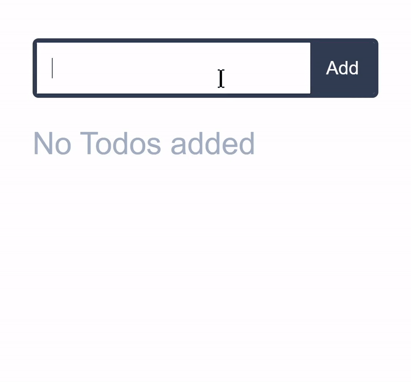

<!-- logo -->
<p align="center">
  
</p>

<!-- tag line -->
<h3 align='center'> Make Your React App Truly Reactive ! </h3>

<!-- badges -->
<p align="center">

<!-- version -->


<!-- size -->


<!-- downloads npm per week  -->


<!-- language  -->


<!-- stars -->


<!-- follow -->


<a href='https://twitter.com/intent/tweet?url=https%3A%2F%2Fgithub.com%2FMananTank%2Fradioactive-state&via=MananTank_&text=Make%20your%20@react%20App%20Truly%20Reactive%20with%20radioactive-state&hashtags=react%2CradioactiveState' target='_blank'>


</a>

</p>

<br/>
<!-- badges -->

<!-- hash:  -->

## Features

☢ Deeply Reactive, Directly Mutate State at any level to Update Component

⚡ Blazing Fast - 25% faster than `useState`

📺 No Extra Re-Renders - Auto Mutation batching

🌿 Always Fresh State, _unlike_ `useState`

🧬 Reactive Bindings For Inputs

⚛ Reactive Props !

☕ Zero Dependencies, Ultra Light-Weight `830 b`


<br/>

## 🎯 Goal

**Make React development as easy as possible** with an elegant and powerful state management API that improves your workflow and makes your applications faster and less error prone.

<br/>

## 🌻 Motivation

While the React's `useState` hook has been great for simple states, it is still **a pain to update a complex state**.

It also comes with other problems like **not having the access to fresh state right away** after the state is set and closure problems because of `useState`'s state only updating the state's value after a re-render. This can create frustrating bugs.

We can eliminate these problems, improve performance and introduce exciting new features in React with a **Truly Reactive State !**

Enter `radioactive-state`

<br/>

## ☢️ What's a Radioactive-State ?

> Radioactive state is a **deeply reactive** state.
> When it is mutated at any level ( shallow or deep ) it re-renders the component automatically !

No need to set the state. No need to use libraries like immer.js to produce a new State. No overhead of creating a new state at all! **Just mutate your state, that's it !**

<br/>

## ✨ useRS hook

`radioactive-state` gives you a hook - `useRS` ( use radioactive state ) which lets you create a radioactive state in your React Components.
Let's see a few simple examples :

<details>
<summary> 🍭 <strong>Counter App</strong> <p align='center'>

</p> </summary>
<br/>


```jsx
import useRS from 'radioactive-state';

const Counter = () => {
  // create a radioactive state
  const state = useRS({
    count: 0,
  });

  // yep, that's it
  const increment = () => state.count++;

  return <div onClick={increment}>{state.count}</div>;
};
```

<a href='https://codesandbox.io/s/counter-example-v9bsh?file=/src/Counter.js' target="_blank" title='counter app'>Open in CodeSandbox</a>

</details>

---

<details> <summary> 🍡 <strong> Array Of Counters App </strong> <p align='center'>  </p></summary>

Let's take this a step further, Let's make an app that has an array of counters, each of them can be incremented individually and all of their sum is displayed too

This examples shows that deep mutation also triggers a re-render and that **you can use any mutative functions directly**, you don't have to create new state.


```jsx
import useRS from "radioactive-state";


const Counters = () => {

  const state = useRS({
    counts: [0],
    sum: 0
  });

  const increment = (i) => {
    state.counts[i]++;
    state.sum++;
  };

  const addCounter = () => state.counts.push(0);

  return (
    <>
      <button onClick={addCounter}> Add Counter </button>
      <div className="counts">
        {state.counts.map((count, i) => (
          <div className="count" onClick={() => increment(i)} key={i}>
            {count}
          </div>
        ))}
      </div>
      <div className="count sum">{state.sum}</div>
    </>
  );
};
```

<a href='https://codesandbox.io/s/counters-example-sctz6?file=/src/Counters.js' target="_blank" title='counter app'>Open in CodeSandbox</a>

</details>
<br />

## 📺 No Extra Re-Renders, Mutations are Batched

You might be wondering:

> "What if I mutate multiple things in state, Is that gonna re-render component multiple times ?"

**Nope!** 😉

#### Example:

```js
// suppose you are mutating multiple things in your state in a function doStuff

const doStuff = () => {
  state.a = 200;
  state.b.x.y.push([10, 20, 30]);
  state.c++;
  state.c++;
  state.c++;
  delete state.d.e.f;
  state.e.splice(10, 1);
  state.f = state.f.filter(x => x.completed);
};

// When this function is called
// it is not **not** going to trigger re-render of component 8 times 😉
// it will only trigger re-render 1 time! - No extra re-renders! 🤗
```

#### 🤨 How is that possible ?

When you start mutating your state, radioactive-state schedules an async re-render to run after all the sync code is executed.
So, No matter how many times you mutate the state, it only triggers re-render once 😙


<br/>

## 🌿 State is always fresh !

unlike `useState`, `useRS`'s state is always fresh

#### What does that mean ?

when you set a new state using `useState`'s setter function, it does not directly change the value of state. value of state is changed only after a re-render. This can cause some weird bugs.

Let's see those problems and see how `radioactive-state` is immune to them.


<details>

<summary>
<code>useState</code>'s state is not always fresh
</summary>

<br/>

Let's add Logs before and after the state is set in our counter app.


```js
const [count, setCount] = useState(0)

const increment = () => {
  console.log('before: ', count)
  setCount(count + 1)
  console.log('after: ', count)
}

// when increment is called, you would get this logs:
// before: 0
// after: 0

// same thing happens no matter what data type you are using - reference type or value type
```

<a href='https://codesandbox.io/s/usestate-s-state-is-not-always-fresh-pfzpw?file=/src/App.js' target='_black'>
Live Demo
</a>

<br/>
<br/>

#### `useRS` solves it !

`useRS`'s state is mutated directly by the user. So, **No need to wait for a re-render to get the fresh state**.

```js
const state = useRS({
    count: 0
  })

const increment = () => {
  console.log('before: ', state.count)
  state.count++
  console.log('after: ', state.count)
}

// works as expected 😄
// before: 0
// after: 1
```

<a href='https://codesandbox.io/s/usestate-s-state-is-not-always-fresh-pfzpw?file=/src/App.js' target='_black'>
Live Demo
</a>

<br/>
<br/>

With radioactive-state, You can use your state with confidence that whenever you use it, it's gonna be fresh ! 😙

<br/>

</details>

<details>
<summary><code>useState</code>'s closure problem </summary>

<br/>

Let's assume that increment function is async and before incrementing the value of count, we have to wait for some async task.

Now guess what happens if you click the counter quickly 3 times?
count is only going to increment to 1 instead of 3, even though increment function is called 3 times !

```js
const [count, setCount] = useState(0)

const increment = async () => {
  await someAsyncTask(); // assume that this takes about 500ms
  setCount(count + 1) // does not work properly
}

```
<a href='https://codesandbox.io/s/usestates-closure-problem-x6g28?file=/src/App.js' target='_black'>
Live Demo
</a>

<br/>

This happens because setCount keeps using old value of count until the component re-renders.
This is because increment function "closes over" the count when it was defined

```js
// to fix this you have would have to set the state like this
// this creates confusion about what happens when
setCount(previousCount => previousCount + 1)
```

This gets really complex when you want to update other states based newValue of one state.
We would have to nest setters one inside another 🤮

#### `useRS` does not have this problem !

```js
const state = useRS({
  count: 0
})

const increment = async () => {
  await someAsyncTask(); // assume that this takes about 500ms
  state.count++ // works ! 😙
}

```

If you click the button 3 times quickly, count will only increment from 0 to 3 after 500ms. It works as expected 🙌

<a href='https://codesandbox.io/s/users-solves-the-closure-problem-2iys5?file=/src/App.js' target='_black'>
Live Demo
</a>
</details>

<br/>

## ⚡ Radioactive State is blazing fast !

`radioactive-state` is **25% faster** than `useState` for a fairly Complex State.

> This number is derived from an average of 100 performance tests where an array of 200 objects is rendered and various operations like adding, removing, re-ordering and mutations where done one after another.

Note that, radioactive-state **keeps getting faster and faster** compared to useState if you keep increasing the complexity of state, **even more than 25%**

But, **for an average web app**, both will have about the **same performance** where state of a component is not that complex

### Why is it faster than `useState` ?

In the case of `useState`, every time you want to update the state, you have to create a new state and call setter function with the newState.

But, in case of `radioactive-state` **you don't have to create a new state**, you just mutate the state and that's it. radioactive-state **does not create a newState** under the hood either. There are other optimizations as well, which makes sure no extra work is done, no extra re-renders are triggered.

<!-- ------------------------------------------------ -->

<br/>

## 🧬 Reactive bindings for inputs


<details>
<summary> You can create a controlled input the old way like this </summary>


### using the `useState`
```jsx

const [input, setInput] = useState("type something");

<input
  value={input}
  onChange={(e) => setInput(e.target.value)}
  type='text'
/>
```

### using the useRS

```jsx
// creating state
const state = useRS({
  input: ''
})

<input
  value={state.input}
  onChange={(e) => state.input = e.target.value}
  type='text'
/>
```

Both are fairly easy but becomes annoying if you have a form with multiple inputs

You would also have to convert string to number if the input is type 'number' or 'range'.
You would also need to use 'checked' prop instead of 'value' for checkboxes and radios

---

</details>

<br/>

radioactive-state provides a binding API that lets you bind an input's value to a key in state.

To bind `state.key` to an input you prefix the key with $ - `state.$key` and then spread over the input. that's it ! 😮

```js
<input {...state.$key}  />
```


This works because, `state.key` returns the value but `state.$key` returns an object containing value and onChange props, which we are spreading over input

#### Bindings takes care of different types of inputs

Bindings **rely on initial value of the key** in state to figure out what type of input it is

if the initial value is a type of `string` or `number`, `state.$key` return `value` and `onChange`.
If the initial value is of type `boolean`, `state.$key` returns `checked` and `onChange` props and uses `e.target.checked` internally

If the initial value is `number` type, onChange function converts the `e.target.value` from `string` to `number` then saves it

#### Example

```jsx

const state = useRS({
  a: 20,
  b: 10,
  c: true,
  d: false,
  e: '',
  f: '',
  g: ''
})

<input type='number' {...state.$age} />
<input type='range' {...state.$b} />
<input type='checkbox' {...state.$c} />
<input type='radio' {...state.$d} />
<input type='text' {...state.$e} />
<textarea {...state.$f} />
<select {...state.$g}> ... </select>

```
<br/>

## ⚛ Reactive Props

In traditional React, Props are considered immutable and mutating them does nothing. But When using radioactive-state, if you pass a piece of state as a prop to child component, this **child component has the capability to trigger a re-render in parent component** by mutating the prop !

This can be a **powerful feature**, where **you no longer have to pass functions as props to child component for triggering a re-render in parent component**, which also removes the need to memoize that function

Let's see this in action

<details>
  <br/>
  <summary> Todos App
    <p align='center'>
      
    </p>
  </summary>

  <a href='https://codesandbox.io/s/todos-example-zivos?file=/src/AddTodo.js' target='_black'>
  Live Demo
  </a>
</details>


## FAQs


#### Can I use useRS hook more than once ?

#### How does it work, Is it magic ?

#### Should I ditch useState and just use useRS ?