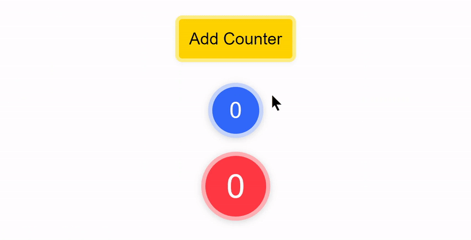

<!-- logo -->
<p align="center">
  
</p>

<!-- tag line -->
<h3 align='center'> Make Your React App Truly Reactive ! </h3>

<!-- badges -->
<p align="center">

<!-- version -->


<!-- size -->


<!-- downloads npm per week  -->


<!-- language  -->


<!-- stars -->


<!-- follow -->


<a href='https://twitter.com/intent/tweet?url=https%3A%2F%2Fgithub.com%2FMananTank%2Fradioactive-state&via=MananTank_&text=Make%20your%20@react%20App%20Truly%20Reactive%20with%20radioactive-state&hashtags=react%2CradioactiveState' target='_blank'>


</a>

</p>

<br/>
<!-- badges -->

<!-- hash:  -->

## Features

☢ **Deeply Reactive**, Directly Mutate State at any level to Update Component

🏎️ **Blazing Fast** - 25% faster than `useState`

🌿 **Always Fresh State**, _unlike_ `useState`

🧬 **Reactive Bindings** For Inputs

🔁 Free **Two-Way Binding**

📺 No Extra Re-Renders - **Auto Mutation batching**

☕ **Zero Dependencies**, Ultra Light-Weight `830 b`

<br />

## 🤔 Motivation

While the React's `useState` hook has been great for simple states, it is still **a pain to update a complex state**.

It also comes with other problems like **not having the access to fresh state right away** after the state is set and async event handlers using the old value of state because of closure. These problems occur because `useState`'s state only updates after a re-render. This can create frustrating bugs.

We can eliminate all these problems and even introduce exciting new features in React with a **Truly Reactive State !**

Enter `radioactive-state`

<br/>

## 🧐 What's a Radioactive-State ?

> Radioactive state is a **deeply reactive** state.
> When it is mutated at any level ( shallow or deep ) it re-renders the component automatically !

No need to set the state. No need to use libraries like immer.js to produce a new State. No overhead of creating a new state at all!

**Just mutate your state, that's it !**

<br/>

## Creating a radioactive-state with useRS hook

`radioactive-state` gives you a hook to create a radioactive-state in your component. Let's see it in action

### Examples

<details>
<summary> 🍭 <strong>Counter App</strong> <p align='center'>

</p> </summary>
<br/>


```jsx
import useRS from 'radioactive-state';

const Counter = () => {
  // create a radioactive state
  const state = useRS({
    count: 0,
  });

  // yep, that's it
  const increment = () => state.count++;

  return <div onClick={increment}>{state.count}</div>;
};
```

<a href='https://codesandbox.io/s/counter-example-v9bsh?file=/src/Counter.js' target="_blank" title='counter app'>Open in CodeSandbox</a>

</details>

---

<details> <summary> 🍡 <strong> Array Of Counters App </strong> <p align='center'>  </p></summary>

Let's take this a step further, Let's make an app that has an array of counters, each of them can be incremented individually and all of their sum is displayed too


```jsx
import useRS from 'radioactive-state';

const Counters = () => {
  const state = useRS({
    counts: [0],
  });

  // deep mutation also triggers re-render !
  const increment = i => state.counts[i]++;
  const addCounter = () => state.counts.push(0);

  return (
    <>
      <button onClick={addCounter}> Add Counter </button>

      <div className='counts'>
        {state.counts.map((count, i) => (
          <div className='count' onClick={() => increment(i)} key={i}>
            {count}
          </div>
        ))}
      </div>

      <div className='count total'>{state.counts.reduce((x, sum) => sum + x, 0)}</div>
    </>
  );
};

export default Counters;
```

<a href='https://codesandbox.io/s/counters-example-sctz6?file=/src/Counters.js' target="_blank" title='counter app'>Open in CodeSandbox</a>

</details>
<br />

## 📺 No Extra Re-Renders, Mutations are Batched

You might be wondering:

> "What if I mutate multiple things in state, Is that gonna re-render component multiple times ?"

**Nope!** 😉

#### Example:

```js
// suppose you are mutating multiple things in your state in a function doStuff

const doStuff = () => {
  state.a = 200;
  state.b.x.y.push([10, 20, 30]);
  state.c++;
  state.c++;
  state.c++;
  delete state.d.e.f;
  state.e.splice(10, 1);
  state.f = state.f.filter(x => x.completed);
};

// When this function is called
// it is not **not** going to trigger re-render of component 8 times 😉
// it will only trigger re-render 1 time! - No extra re-renders! 🤗
```

#### 🤨 How is that possible ?

When you start mutating your state, radioactive-state schedules an async re-render to run after the all the sync code is executed. So, No matter how many times you mutate the state, it only triggers re-render once 😙


<br/>

## 🌿 State is always fresh

unlike `useState`, `useRS`'s state is always fresh

#### What does that mean ?

when you set a new state using `useState`'s setter function, it does not directly change the value of state. value of state is changed only after a re-render. This can cause some weird bugs


<details>
<summary>
<code>useState</code>'s state is not always fresh</summary>

```js
const [count, setCount] = useState(0)

// inside this function, count's value will not change
const increment = () => {
  console.log('before: ', count)
  setCount(count + 1)
  console.log('after: ', count)
}

// when increment is called, you would get this logs:

// before: 0
// after: 0

// this happens to reference type data as well
```

<a href='https://codesandbox.io/s/usestate-s-state-is-not-always-fresh-pfzpw?file=/src/App.js' target='_black'>
Open in CodeSanbox
</a>

<br/>
<br/>

#### `useRS` solves it !

`useRS`'s **state instantly changes it's value** when mutated and does not wait for a re-render.

```js
const state = useRS({
    count: 0
  })

const increment = () => {
  console.log('before: ', state.count)
  state.count++
  console.log('after: ', state.count)
}

// works as expected 😄
// before: 0
// after: 1
```

<a href='https://codesandbox.io/s/usestate-s-state-is-not-always-fresh-pfzpw?file=/src/App.js' target='_black'>
Open in CodeSanbox
</a>

<br/>
<br/>

With radioactive-state, You can use your state with confidence that whenever you use it, it's gonna be fresh ! 😙

<br/>

</details>

<details>
<summary><code>useState</code>'s closure problem </summary>

Let's assume that increment function is async and before incrementing the value of count, we have to wait for some async task.

```js
const [count, setCount] = useState(0)

const increment = async () => {
  await someAsyncTask(); // assume that this takes about 500ms
  setCount(count + 1) // does not work properly
}
```
Now guess what happens if users clicks counter quickly 3 times? count is only going to increment to 1 instead of 3, even though increment function is called 3 times

This happens because setCount keeps using old value of count until the component re-renders.
This is due to increment function closing over the count when it was defined.

```js
// to fix this you have to set the state like this
// this creates confusion about what happens when
setCount(previousCount => previousCount + 1)
```

This gets really complex when you want to update other states based newValue of one state. We would have to nest setters one inside another 🤮

#### `useRS` solves it !

```js

const increment = async () => {
  await someAsyncTask(); // assume that this takes about 500ms
  state.count++ // works ! 😙
}

```

If you click the button 3 times quickly, count will only increment from 0 to 3 after 500ms. It works as expected 🙌
</details>